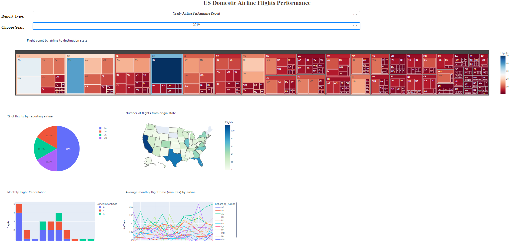
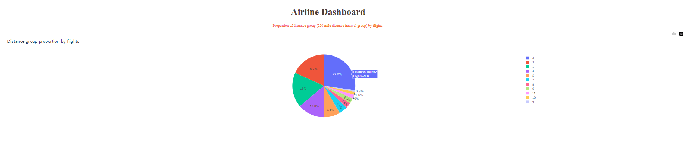
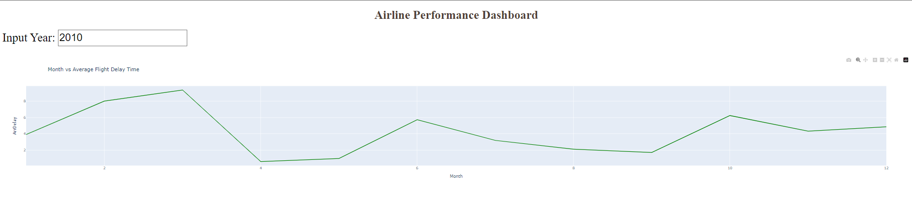
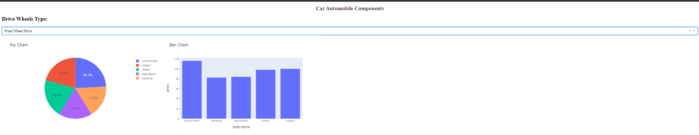
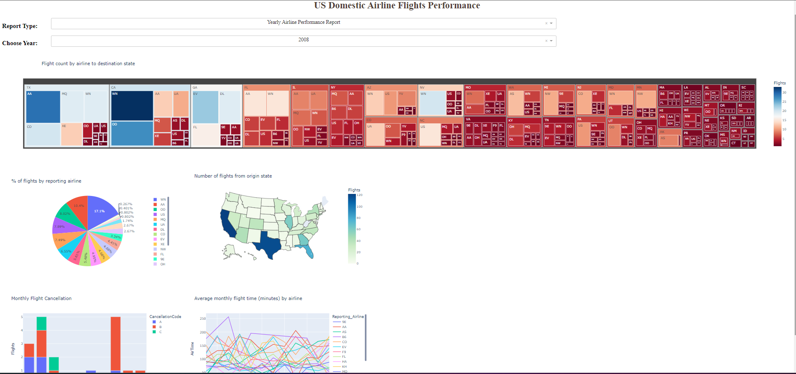

# US Domectic Airline Flight Performance

## flight_delay.py: Seçilen yıla ve rapor türüne göre veri setinden alınan bilgilerin otomatik olarak grafiklere yansıtılması sağlar.

## dash_basics.py: Veri setindendeki bilgileri kullanarak uçuş sayısını ve grubu pie grafiği ile görselleştirir.

## dash_interactivity.py: Veri setindendeki bilgileri kullanarak seçilen yıla göre uçak gecikmelerini aylara göre dağılımını çubuk grafiğinde gösterilmiştir.

## dash_layout.py: Veri setindendeki bilgileri kullanarak seçilen araba tipine göre otomatik olarak görselleştirir.

## auto.py: Seçilen yıla ve rapor türüne göre veri setinden alınan bilgilerin otomatik olarak grafiklere yansıtılmasını sağlar.

